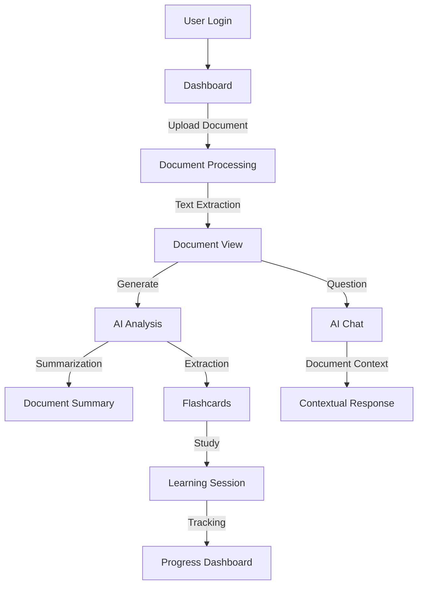

<div align="center">
  
# ✨ MindGrove - AI-Powered Academic Research Assistant ✨

[](https://opensource.org/licenses/MIT)
[](https://reactjs.org/)
[](https://www.typescriptlang.org/)
[](https://tailwindcss.com/)
[](https://openai.com/)

<h3>Transforming Academic Research & Learning Through AI</h3>


</div>

---

## 📚 Table of Contents
1. [Introduction](#-introduction)
2. [Features](#-features)
3. [Tech Stack](#-tech-stack)
4. [Project Structure](#-project-structure)
5. [Application Flow](#-application-flow)
6. [Installation](#-installation)
7. [Usage](#-usage)
8. [API & Integration](#-api--integration)
9. [Roadmap](#-roadmap)
10. [Contributing](#-contributing)
11. [License](#-license)

---

## 📖 Introduction

MindGrove is an innovative AI-powered platform designed to enhance academic research and learning through intelligent document analysis, summarization, and knowledge extraction. It aims to transform the way researchers, students, and educators interact with academic content, making knowledge more accessible and easier to retain.

**Mission**: To make academic knowledge more accessible, comprehensible, and memorable through the power of artificial intelligence.

---

## ✨ Features

### 🤖 AI-Powered Document Intelligence
- **Smart Summarization**: Automatically extract key concepts, findings, and conclusions
- **Personalized Flashcard Generation**: Convert long documents into bite-sized learning material
- **Context-Aware AI Chat**: Ask questions about your documents and get precise answers

### 📄 Document Management
- Upload and organize PDFs, Word documents, and research papers
- Automatic metadata extraction (authors, publication dates, keywords)
- Search across your entire document library with semantic search

### 📚 Learning Enhancement
- Interactive flashcards with spaced repetition
- Knowledge tracking to monitor progress
- Citation management for academic writing

### 👨‍💻 User Experience
- Clean, modern interface with light/dark mode
- Mobile-optimized for learning on-the-go
- Guided onboarding for new users

---

## 🛠 Tech Stack

MindGrove is built with modern, robust technologies to ensure performance, scalability, and developer experience:

### Frontend
- **React 18** with TypeScript for UI
- **Tailwind CSS** and **shadcn/ui** for styling
- **Framer Motion** for animations
- **Tanstack Query** for data fetching and state management
- **Vite** for development and building

### Backend & Services
- **Supabase** for authentication, database, and storage
- **OpenAI API** for document understanding and generation
- **PDF.js** for document rendering and text extraction

---

## 📂 Project Structure

```
mindgrove/
├── public/
│   ├── fonts/
│   ├── icons/
│   └── sounds/
├── src/
│   ├── components/
│   │   ├── animations/
│   │   ├── chat/
│   │   ├── dashboard/
│   │   ├── document/
│   │   ├── flashcards/
│   │   ├── layout/
│   │   ├── onboarding/
│   │   ├── profile/
│   │   └── ui/
│   ├── hooks/
│   ├── integrations/
│   │   └── supabase/
│   ├── pages/
│   ├── store/
│   ├── styles/
│   ├── types/
│   └── utils/
├── tests/
└── config files (vite.config.ts, tsconfig.json, etc.)
```

---

## 🔄 Application Flow



---

## 🚀 Installation

### Prerequisites
- Node.js 16+ and npm/yarn
- Supabase account for backend services

### Setup Steps

1. Clone the repository:
```bash
git clone https://github.com/yourusername/mindgrove.git
cd mindgrove
```

2. Install dependencies:
```bash
npm install
# or
yarn
```

3. Set up environment variables:
```bash
cp .env.example .env
# Edit .env with your API keys and configuration
```

4. Start the development server:
```bash
npm run dev
# or
yarn dev
```

5. Build for production:
```bash
npm run build
# or
yarn build
```

---

## 📝 Usage

### Document Upload
1. Navigate to the Documents tab
2. Click "Upload New" and select your PDF/DOCX file
3. The system will automatically process and extract text

### AI Analysis
1. Open a document from your library
2. Click "Generate Summary" to create an AI-powered overview
3. Use "Create Flashcards" to generate study materials

### AI Chat
1. Click on the chat icon while viewing a document
2. Ask questions about the content
3. The AI will respond with contextual insights

---

## 🔌 API & Integration

MindGrove integrates with several powerful APIs:

### OpenAI
- Used for document summarization, flashcard generation, and contextual chat
- Configured via API key in environment variables

### Supabase
- Authentication, user management, and document storage
- Database for user profiles, document metadata, and flashcards

### PDF Processing
- PDF.js for client-side text extraction
- OCR capabilities for scanned documents

---

## 🗓️ Roadmap

### Short-term (Next 3 months)
- [ ] Advanced document annotation tools
- [ ] Citation export in multiple formats
- [ ] Collaborative document sharing

### Mid-term (6-12 months)
- [ ] Mobile apps for iOS and Android
- [ ] Integration with reference managers
- [ ] Advanced analytics dashboard

### Long-term (Beyond 12 months)
- [ ] Research graph visualization
- [ ] Academic writing assistant
- [ ] Institution and classroom management

---

## 👥 Contributing

We welcome contributions to MindGrove! Please see our [CONTRIBUTING.md](CONTRIBUTING.md) for details on how to get started.

### Development Process
1. Fork the repository
2. Create a feature branch
3. Make your changes
4. Submit a pull request

### Code Standards
- We follow ESLint and Prettier configurations
- All code must be typed with TypeScript
- Components should be well-documented with JSDoc comments

---

## 📄 License

MindGrove is licensed under the MIT License - see the [LICENSE](LICENSE) file for details.

---

<div align="center">
  <p>Made with ❤️ by the MindGrove Team</p>
  <p>© 2024 MindGrove. All rights reserved.</p>
</div>
