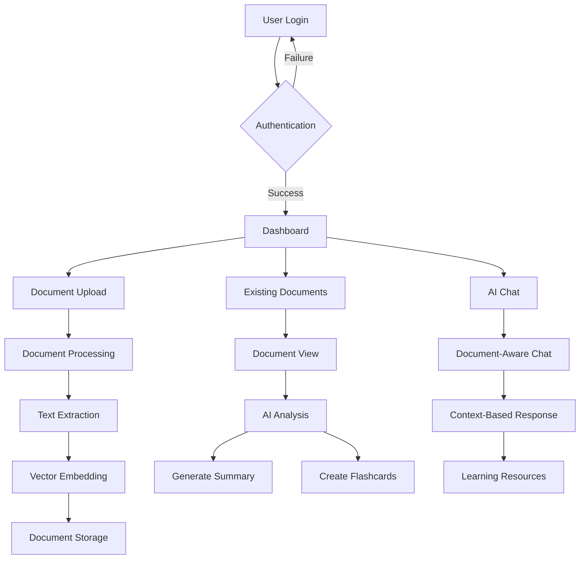

# MindGrove - Document Intelligence Platform

<p align="center">
  
</p>

MindGrove is a powerful document intelligence platform designed to revolutionize how students, researchers, and professionals interact with their documents. Combining AI-powered document processing with intuitive learning tools, MindGrove transforms static documents into dynamic knowledge resources.

## Key Features

### 💻 Document Management
- **Smart document uploads** with automatic text extraction and indexing
- **Document organization** with tags, folders, and search functionality
- **Multi-format support** for PDFs, DOCx, TXT, and more

### 🤖 AI-Powered Analysis
- **Intelligent document summarization** to extract key insights
- **Context-aware Q&A** with your documents
- **Automatic flashcard generation** from document content
- **Code artifact generation** from technical content (Premium)

### 📱 Learning Tools
- **Spaced repetition flashcards** to optimize learning retention
- **Study session tracking** with analytics
- **Streak counter** to maintain learning momentum

### ✨ Premium Features
MindGrove offers tiered subscription options:
- **Free**: Basic document uploads and limited AI features
- **Weekly**: Expanded document processing and advanced AI tools
- **Monthly**: Unlimited features including code generation and advanced analytics

## Technologies Used

MindGrove is built with a modern tech stack for performance and scalability:

- **Frontend**: React, TypeScript, TailwindCSS, Shadcn UI
- **Backend**: Supabase (Auth, Database, Storage, Edge Functions)
- **AI**: OpenAI API, Vector embeddings
- **Deployment**: Vite, Docker

## Project Structure

```
MindGrove/
├── public/           # Public assets, icons, and manifest
├── src/              
│   ├── components/   # UI components
│   │   ├── auth/     # Authentication components
│   │   ├── document/ # Document-related components
│   │   ├── ui/       # Reusable UI components
│   │   └── ...
│   ├── hooks/        # Custom React hooks
│   ├── integrations/ # External service integrations
│   ├── pages/        # Application pages/routes
│   ├── services/     # Business logic services
│   ├── store/        # Global state management
│   ├── utils/        # Utility functions
│   └── main.tsx      # Application entry point
├── supabase/         # Supabase configuration
│   ├── functions/    # Edge functions
│   └── migrations/   # Database migrations
└── README.md         # Project documentation
```

## Application Flow



## Getting Started

1. **Clone the repository**:
   ```
   git clone https://github.com/yourusername/mindgrove.git
   cd mindgrove
   ```

2. **Install dependencies**:
   ```
   npm install
   ```

3. **Set up environment variables**:
   - Create a Supabase project
   - Set up the required API keys

4. **Run the development server**:
   ```
   npm run dev
   ```

## Contributing

We welcome contributions to MindGrove! Please see our contributing guidelines for more information on how to participate.

## License

MindGrove is released under the MIT License. See LICENSE file for details.

---

Built with ❤️ by MindGrove Team
